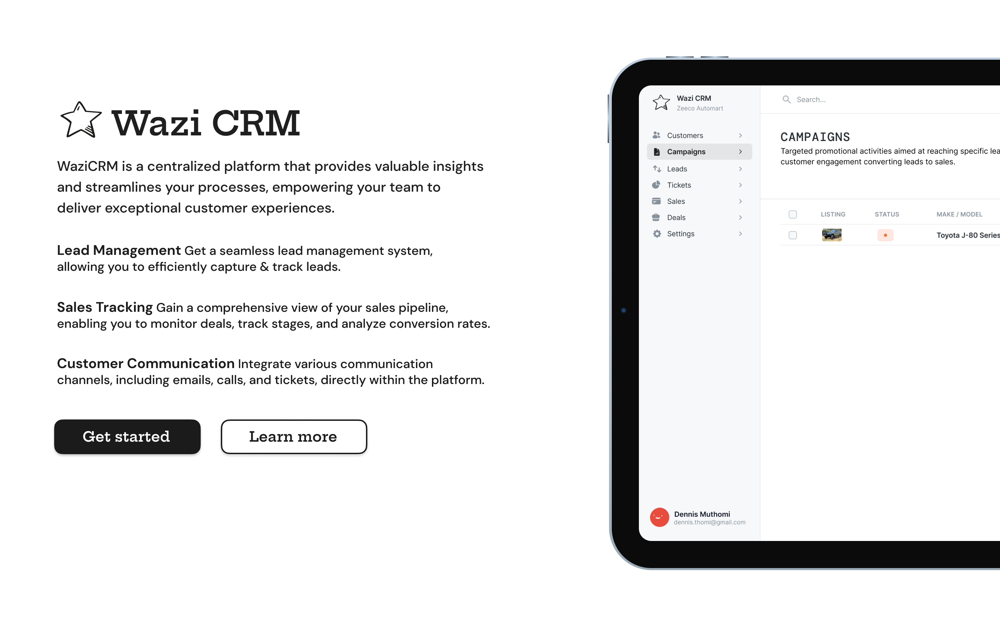

## SpaceYaTech Laravel

The SpaceYaTech Content Management system is an open-application that lets users to quickly publish content and share it with ease to their audience. Inspired by existing CMSes like Hashnode, Wordpress, DEV and Joomla, we felt the need to create an African CMS created by young Africans looking to learn by contributing to Open Source. SpaceYaTech opted for a CMS as the debut open source project because of the technicalities involved in creating, maintaining and scaling a CMS. A CMS poses great technical challenges and a great learning opportunity for those looking to grow their tech skills.

The first edition of the CMS, should at the bare minimum:

- Let Users create accounts using their email addresses.
- Let Users sign-in to their accounts using their email addresses or third-party auth services.
- Let Users customize their profiles/accounts i.e Change avatars and bio-data.
- Let Users create and persist content containing different media.
- Let Users delete content they don't want to appear on their accounts.
- Let Users post comments on posts they find useful.
- Let Users react to posts and comments that they find useful.
- Let Users own a subdomain prefixed by their username e.g username.spaceyatech.com

There is a nice project [wiki](https://github.com/SpaceyaTech/CMS-Backend-Repository/wiki/Technical-Description-Of-Product) that describes the technical aspects of the Open-Source CMS we're trying to build.

## Getting Started
 To get started with the project locally check out the [installation guide](https://github.com/SpaceyaTech/Team-Rio-Laravel/.github/INSTALL.md/) to get up and running quickly.

## Contributing
Thanks for your interest in contributing to SpaceYaTech Laravel Repo!! 

All the pull requests should be directed to the dev branch for peer reviewing then later after thorough testing and passing our CI/CD pipeline (Github Actions) and hopefully everything works well  dev will be merged to the main branch.

It's never a fun experience to have your pull request declined after investing a lot of time and effort into a new feature. To avoid this from happening, we request that contributors create [a feature request](https://github.com/SpaceyaTech/Team-Rio-Laravel/discussions/categories/ideas) to first discuss all new ideas. This helps anyone trying to follow up with the project know why we decided to do things the way did them, includes things like adding new php/laravel packages, styling/linting helpers, etc.
